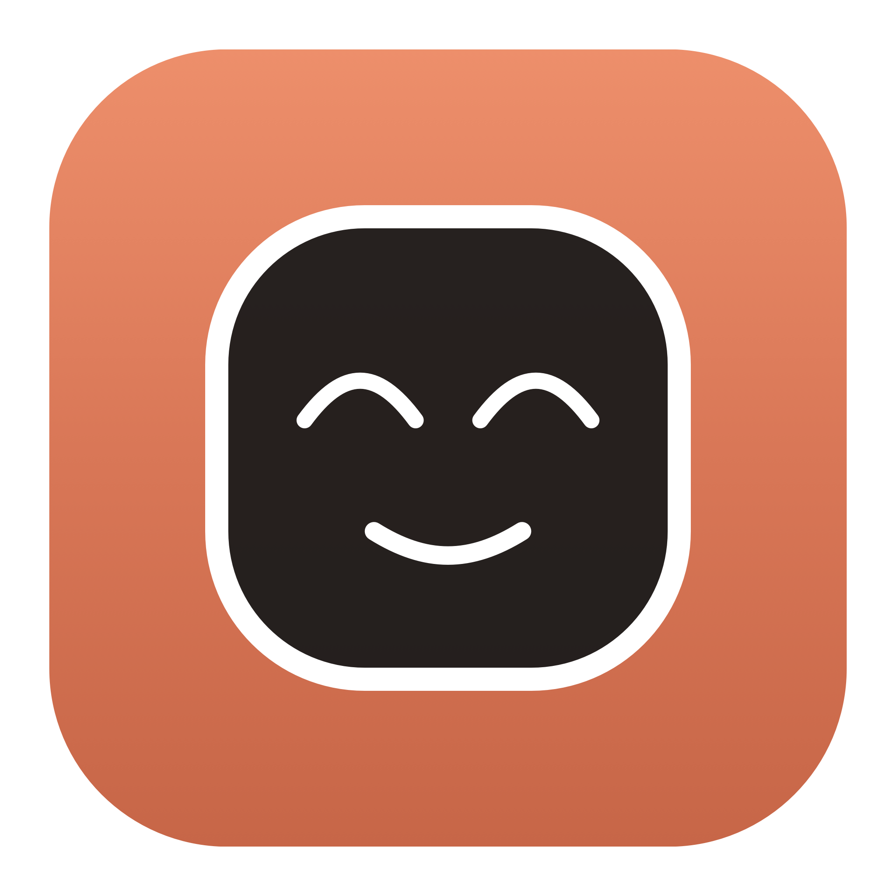
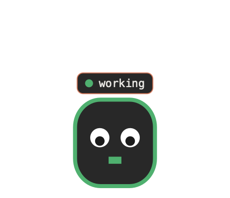
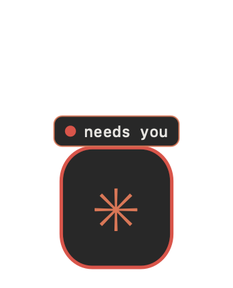
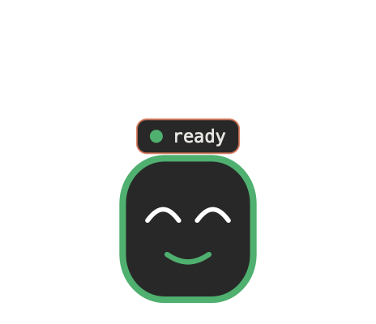

<p align="center"></p>
<h1 align="center">Claude Pet</h1>

<p align="center">
  A floating desktop companion for <b>Claude Code</b> that mirrors your session
  state in real time — like Codex Pets, but for Claude Code, in the Claude
  terminal aesthetic, and <b>compatible with Codex pet sprites</b>.
</p>

<p align="center">
  
  
  
</p>
<p align="center"><sub>The built-in mascot (original art) reacting to session state. Load any Codex pet to replace it.</sub></p>

---

## What it does

A small animated pet sits in the corner of your screen — above every app and
across all Spaces — and reacts to what Claude Code is doing. Glance at it
instead of switching back to the terminal.

## Codex-compatible sprites 🎉

Claude Pet renders the **exact Codex pet atlas**: an `8×9` grid of `192×208`
cells (`1536×1872` WebP), with all **9 animation states**. That means **any pet
from [codex-pets.net](https://codex-pets.net) or the `hatch-pet` skill drops
straight in** — `spritesheet.webp` and all.

## Session state → animation

Every Codex state is wired to a real Claude Code hook:

| Codex state     | Claude Code hook        | Meaning                        | Pill        |
|-----------------|-------------------------|--------------------------------|-------------|
| `waving`        | `SessionStart`          | session begins (→ idle)        | `● hello`   |
| `running-right` | `UserPromptSubmit`      | new turn starts                | `● working` |
| `running`       | `PreToolUse`            | actively working               | `● working` |
| `running-left`  | `PostToolUse`           | step finished                  | `● working` |
| `waiting`       | `Notification` / `PermissionRequest` | needs your input  | `● needs you` |
| `jumping`       | `Stop`                  | turn done (→ review)           | `● done!`   |
| `review`        | (after `Stop`)          | ready for your next prompt     | `● ready`   |
| `failed`        | `StopFailure`           | the turn errored               | `● error`   |
| `idle`          | (after `waving`)        | at rest                        | —           |

Each hook writes `~/.claude-pet/sessions/<session_id>.json`; the overlay watches
the folder and animates. `waving` and `jumping` are one-shots that settle into
`idle` and `review`. No polling of Claude, no network.

## Calm by design

The animation follows an **attention budget**: when Claude is *working*, the pet
stays still and just looks busy (a slow typing cursor) so it never distracts you.
When it **needs you** it gets your attention — a gentle bob and a pulsing halo —
then settles down again once handled. `ready` gives a soft positive nudge,
`error` a small shake. Calm while you work; loud only when it matters.

## Multiple sessions — one tidy stack

Run several Claude Code sessions at once and you get **one cohesive stack**, not a
mess of windows. The **most relevant session** is the prominent pet in the
corner; the rest sit in a clean list above it:

- Auto-sorted by what needs you: **needs-input → error → ready → working → idle**.
  When any session finishes or needs input, it rises to become the featured pet.
- Each row shows the session's **AI-generated title** (the same name Claude Code
  shows in its session list, read from the transcript; falls back to the project
  folder) and a color-coded status.

**Go through the stack** to feature whichever you want:

- **Scroll** over the widget to flip through sessions.
- **Click a row** to jump straight to that session.
- **Click the pet** to release back to auto (a small *pinned* label shows when
  you're holding a choice).

Pets appear when sessions start and disappear when they end (stale ones are
pruned). A single session is just one clean, unlabeled pet. Drag the widget
anywhere; it stays put.

## Install

### Easy (no terminal — for everyone)

1. Download `ClaudePet-macos.zip` from the [latest release](../../releases/latest).
2. Unzip, double-click **`Install Claude Pet.command`**.
   - First run: macOS may warn it's unsigned. Right-click → **Open** → **Open**.
3. Restart Claude Code. Your pet appears and reacts.

Control it from the **✳ menu-bar icon**: show/hide, load a pet, reset to default.

### One-click (for technical friends)

```bash
git clone https://github.com/theabecaster/claude-pet.git
cd claude-pet && ./install.sh
```

Builds and wires hooks (non-destructive — your existing hooks are preserved).

## Load a custom pet

- **Menu bar → ✳ → Load Pet…** and pick a Codex `spritesheet.webp`, a `.png`
  sheet, or a whole pet folder, **or**
- `./load-pet.sh https://codex-pets.net/assets/pets/v/…/spritesheet.webp`
- `./load-pet.sh /path/to/petfolder`  (folder containing `spritesheet.webp`)

Reset anytime with **✳ → Reset to Default Pet**. Using a non-Codex sheet?
Override the grid in `~/.claude-pet/frames.json` (see
[`frames.json.example`](frames.json.example)).

> Pets you download are the property of their creators — use art you're allowed
> to use.

## How it works

```
Claude Code ──hook──▶ ClaudePet --state <s> ──▶ ~/.claude-pet/state.json
                                                        │ (watched)
                                          ClaudePet GUI ◀┘  animates overlay
```

One tiny Swift binary. `--state` writes the file and auto-launches the GUI if it
isn't running (single-instance via pidfile). `--install-hooks` /
`--uninstall-hooks` edit `~/.claude/settings.json` **non-destructively and
idempotently**.

## Uninstall

Double-click **`Uninstall Claude Pet.command`**, or:

```bash
.build/release/ClaudePet --uninstall-hooks
pkill -f ClaudePet
rm -rf ~/.claude-pet /Applications/ClaudePet.app
```

## Requirements

macOS 12+ (WebP decoding is built in). Swift / AppKit, no runtime deps.

## Contributing

Forks, issues, and PRs welcome — open PRs against `dev`. See
[CONTRIBUTING.md](CONTRIBUTING.md).

## License

[PolyForm Noncommercial 1.0.0](LICENSE). Use, modify, fork, and share for any
**noncommercial** purpose. You may **not** sell it or use it commercially.
