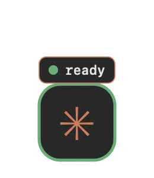

<h1 align="center">✳ Claude Pet</h1>

<p align="center">
  A floating desktop companion for <b>Claude Code</b> that mirrors your session
  state in real time — like Codex Pets, but for Claude Code, in the Claude
  terminal aesthetic, with fully customizable sprites.
</p>

<p align="center">
  
  
  
</p>

---

## What it does

A small animated pet sits in the corner of your screen — above every app and
across all Spaces — and reacts to what Claude Code is doing. Glance at it
instead of switching back to the terminal.

| State      | When                                  | Pet shows                |
|------------|---------------------------------------|--------------------------|
| `running`  | you submit a prompt / a tool runs     | animated, `● working`    |
| `waiting`  | Claude needs approval / your input    | paused, `● needs you`    |
| `ready`    | the turn finishes                     | bounce, `● ready`        |
| `idle`     | session start                         | resting                  |
| `off`      | session ends                          | hidden                   |

State is fed by **Claude Code hooks**, which write `~/.claude-pet/state.json`.
The overlay watches that file and animates. No polling of Claude, no network.

## Feature parity with Codex Pets

| Codex Pets                         | Claude Pet |
|------------------------------------|:----------:|
| Floating overlay over all apps     | ✅ |
| Real-time run / waiting / ready    | ✅ |
| Status indicator                   | ✅ terminal-style pill |
| Show / hide toggle (`/pet`)        | ✅ menu-bar ✳ → Show/Hide |
| Custom / swappable pets (`/hatch`) | ✅ load any PNG sprite sheet |
| Auto-launch with your session      | ✅ |

## Install

### Easy (no terminal, recommended for most people)

1. Download `ClaudePet-macos.zip` from the [latest release](../../releases/latest).
2. Unzip it.
3. Double-click **`Install Claude Pet.command`**.
   - First time: macOS may warn it's from an unidentified developer. Right-click
     the file → **Open** → **Open** to confirm. (It's unsigned open-source code.)
4. Done. Start (or restart) Claude Code — your pet appears and reacts.

Control it from the **✳ icon in your menu bar**: show/hide, load a custom
sprite, or reset to the default pet.

### From source (developers)

Requires Xcode Command Line Tools (`xcode-select --install`).

```bash
git clone https://github.com/<you>/claude-pet.git
cd claude-pet
./install.sh        # builds + wires hooks (non-destructive)
```

## Custom sprites (bring your own pet)

The default is a built-in Claude-styled pet. To use your own sprite sheet:

1. Menu-bar **✳ → Load Sprite…** and pick a PNG, **or** `./load-pet.sh /path/to/sheet.png`.
2. Describe the sheet layout in `~/.claude-pet/frames.json` (see
   [`frames.json.example`](frames.json.example)) — frame size, scale, fps, and
   which frame indices play for each state. Frames are numbered row-major from
   the top-left.
3. Reset anytime with menu-bar **✳ → Reset to Default Pet**.

> Sprite sheets you download (e.g. from sprite galleries) are the property of
> their respective owners. Only use art you have the right to use.

## How it works

```
Claude Code ──hook──▶ ClaudePet --state <s> ──▶ ~/.claude-pet/state.json
                                                        │ (watched)
                                          ClaudePet GUI ◀┘  animates overlay
```

- One tiny Swift binary. `--state` writes the state file and auto-launches the
  GUI if it isn't running (single-instance via a pidfile).
- `--install-hooks` / `--uninstall-hooks` edit `~/.claude/settings.json`
  **non-destructively and idempotently** — your existing hooks are preserved.

## Uninstall

Double-click **`Uninstall Claude Pet.command`**, or from source:

```bash
.build/release/ClaudePet --uninstall-hooks
pkill -f ClaudePet
rm -rf ~/.claude-pet /Applications/ClaudePet.app
```

## Requirements

macOS 12+. Built with Swift / AppKit. No runtime dependencies.

## Contributing

Forks, issues, and pull requests are welcome — improve it, make your own
variants, share them. Open a PR against the `dev` branch. See
[CONTRIBUTING.md](CONTRIBUTING.md).

## License

[PolyForm Noncommercial 1.0.0](LICENSE). You may use, modify, fork, and share
this software **for any noncommercial purpose**. You may **not** sell it, or use
it as part of a commercial product or service. Contributions and personal forks
are encouraged.
