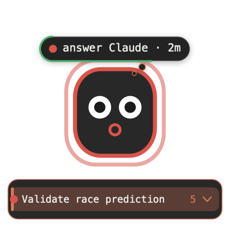

<p align="center"></p>
<h1 align="center">Claude Pet</h1>

<p align="center">
  A floating desktop companion for <b>Claude Code</b> that mirrors your session
  state in real time — like Codex Pets, but for Claude Code, in the Claude
  terminal aesthetic, and <b>compatible with Codex pet sprites</b>.
</p>

<p align="center">
  
  
  
</p>
<p align="center"><sub>The built-in mascot (original art) reacting to session state. Load any Codex pet to replace it.</sub></p>

---

## What it does

A small animated pet sits in the corner of your screen — above every app and
across all Spaces — and reacts to what Claude Code is doing. Glance at it
instead of switching back to the terminal.

## Codex-compatible sprites 🎉

Claude Pet renders the **exact Codex pet atlas**: an `8×9` grid of `192×208`
cells (`1536×1872` WebP), with all **9 animation states**. That means **any pet
from [codex-pets.net](https://codex-pets.net) or the `hatch-pet` skill drops
straight in** — `spritesheet.webp` and all.

## Session state → animation

Every Codex state is wired to a real Claude Code hook:

| Codex state     | Claude Code hook        | Meaning                        | Bubble says (on hover) |
|-----------------|-------------------------|--------------------------------|------------------------|
| `waving`        | `SessionStart`          | session begins (→ idle)        | `hey there`            |
| `running-right` | `UserPromptSubmit`      | new turn starts                | `working…`             |
| `running`       | `PreToolUse`            | actively working               | `editing main.swift`   |
| `running-left`  | `PostToolUse`           | step finished                  | `editing main.swift`   |
| `waiting`       | `Notification` / `PermissionRequest` | needs your input  | `answer Claude`        |
| `running`       | `PreCompact`            | context being compacted        | `compacting context`   |
| `jumping`       | `Stop`                  | turn done (→ review)           | `all done — your turn` |
| `review`        | (after `Stop`)          | ready for your next prompt     | `all done — your turn` |
| `failed`        | `StopFailure`           | the turn errored               | `stopped — rate limited` |
| `idle`          | (after `waving`)        | at rest                        | —                      |

Each hook writes `~/.claude-pet/sessions/<session_id>.json`; the overlay watches
the folder and animates. `waving` and `jumping` are one-shots that settle into
`idle` and `review`. No polling of Claude, no network. (The bubble only shows on
hover — see [below](#calm-at-rest-details-on-hover).)
more specific in practice — see [below](#tells-you-whats-actually-happening).)

## Calm at rest, details on hover

At rest the overlay is **just the pet** — no labels, no panels, so it never distracts
you. **Hover it** and a **thought bubble** drifts up with what's going on (and the
session list appears below); move away and it lingers a few seconds, then fades back to
just the pet.

The bubble talks in plain pet-voice: `editing main.swift` / `running npm` while working,
**`answer Claude`** when it needs you, `all done — your turn` when it finishes,
`stopped — rate limited` on an error — plus a `· 12s` time-in-state. Its **border is a
context gauge** that fills **green → amber → red** as the session's context window fills,
a heads-up before Claude auto-compacts. The gauge is exact when Claude Pet supplies your
status line (it installs one only if you don't already have your own); otherwise it
estimates from token counts.

When a session **needs you** or **errors**, the pet can chime (and re-nudge if you miss
it) — all toggleable in the **✳ menu**, with a master mute.

## Make it yours

- **Themes** — **✳ → Theme**: Claude, Midnight, Grove, Mono. Recolors everything.
- **Pet the pet** — tap it for a happy little hop.
- **It dozes off** — the built-in mascot falls asleep when idle, wakes when work resumes.
- **Global show/hide** — **⌃⌥⌘P** from anywhere.

## Menu bar & terminal

The menu-bar icon is a tiny, state-colored version of your pet, so you can glance up even
with the overlay hidden (**✳ → Show / Hide**). The **✳ menu** also lists your live
sessions (click to switch). In a terminal, `ClaudePet --status` prints a full report —
per session: state, model, context, turns, token totals, an estimated cost, and duration.

## Multiple sessions — one tidy stack

<p align="center"></p>

Run several sessions at once and you get **one cohesive stack**, not a mess of windows.
The selected session is the big pet; a **session picker** sits beneath it. On hover it
**collapses to the active session** (with a count + chevron, e.g. `5 ⌄`); **click to
expand** to all of them in a stable, never-reshuffling order. Each row shows the
session's name (the same one Claude Code uses) and a state dot.

- **Click the picker** to expand; **click a row** to make it the big pet.
- **Scroll** to step through sessions; **drag a row** (expanded) to reorder.
- **Drag the pet** to move the whole widget; it stays put.

## Install

### Easy (no terminal — for everyone)

1. Download `ClaudePet-macos.zip` from the [latest release](../../releases/latest).
2. Unzip, drag **`ClaudePet.app`** to your **Applications** folder, and **open it**.
   The app is signed and notarized, so it opens with no Gatekeeper prompt — and it
   **wires the Claude Code hooks itself** on first launch.
3. Restart Claude Code. Your pet appears and reacts.

Everything is in the **✳ menu-bar icon**: show/hide, theme, alerts, custom pets,
reinstall hooks, uninstall. (No installer scripts — the app installs and removes itself.)

### One-click (for technical friends)

```bash
git clone https://github.com/theabecaster/claude-pet.git
cd claude-pet && ./install.sh
```

Builds and wires hooks (non-destructive — your existing hooks are preserved).

## Load a custom pet

- **Menu bar → ✳ → Get Custom Pets (codex-pets.net)…** opens the pet gallery in
  your browser and walks you through the two steps: download a pet's
  `spritesheet.webp`, then **Load Pet…** to apply it, **or**
- **Menu bar → ✳ → Load Pet…** and pick a Codex `spritesheet.webp`, a `.png`
  sheet, or a whole pet folder, **or**
- `./load-pet.sh https://codex-pets.net/assets/pets/v/…/spritesheet.webp`
- `./load-pet.sh /path/to/petfolder`  (folder containing `spritesheet.webp`)

Reset anytime with **✳ → Reset to Default Pet**. Using a non-Codex sheet?
Override the grid in `~/.claude-pet/frames.json` (see
[`frames.json.example`](frames.json.example)).

> Pets you download are the property of their creators — use art you're allowed
> to use.

## How it works

```
Claude Code ──hook──▶ ClaudePet --state <s> ──▶ ~/.claude-pet/sessions/<id>.json
                                                        │ (watched)
                                          ClaudePet GUI ◀┘  animates overlay
```

One tiny Swift binary. `--state` writes the file and auto-launches the GUI if it
isn't running (single-instance via pidfile). `--install-hooks` /
`--uninstall-hooks` edit `~/.claude/settings.json` **non-destructively and
idempotently**.

## Uninstall

**✳ menu → Uninstall Claude Pet…** — removes the hooks, the app, and `~/.claude-pet`
(your other Claude Code settings are left untouched). Or from a terminal:

```bash
.build/release/ClaudePet --uninstall-hooks
pkill -f ClaudePet
rm -rf ~/.claude-pet /Applications/ClaudePet.app
```

## Requirements

macOS 12+ (WebP decoding is built in). Swift / AppKit, no runtime deps.

## Contributing

Forks, issues, and PRs welcome — open PRs against `dev`. Both `main` and `dev`
are protected (PR + green CI required), and use [Conventional Commits](https://www.conventionalcommits.org)
so releases version themselves: merging to `main` auto-builds and publishes a
GitHub Release. See [CONTRIBUTING.md](CONTRIBUTING.md).

## License

[PolyForm Noncommercial 1.0.0](LICENSE). Use, modify, fork, and share for any
**noncommercial** purpose. You may **not** sell it or use it commercially.
